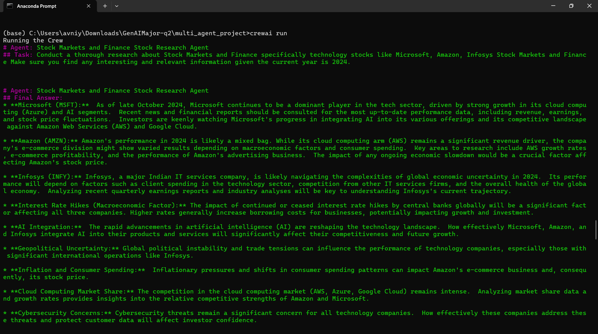
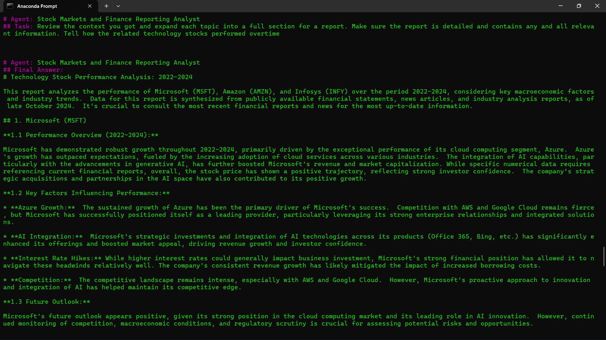
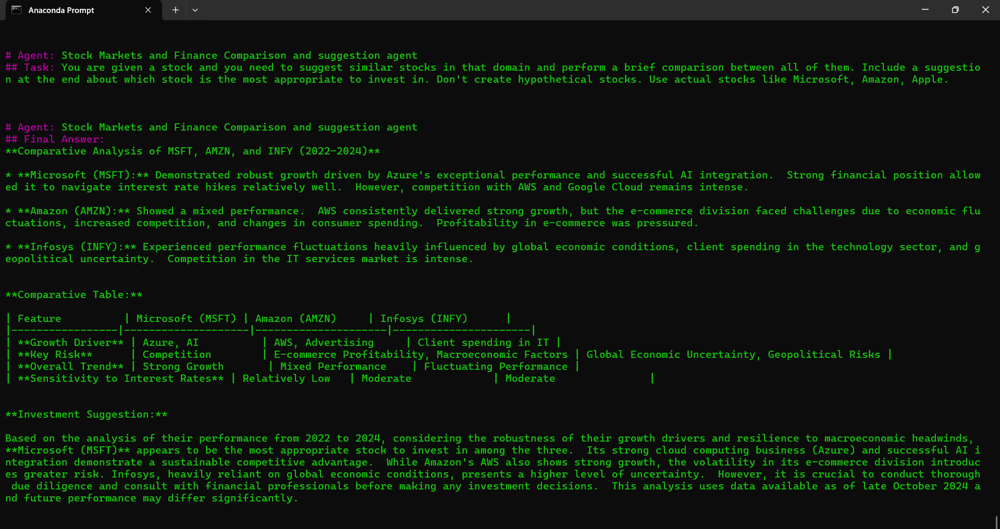

# Multi-agent Stock-Market Analyst
I created a Multi-agent Stock-Market
Analysis system which involves 3 agents
working together to provide information and
Analysis on the Stock Data. It researches the
trends, performs an analysis and provides a
suggestion for stock investment specifically
for technology related stocks. The main files
in the code are : agents.yaml, tasks.yaml,
crew.py, main.py

### LLM used : Gemini Flash 1.5
### Working Demo Link : https://drive.google.com/file/d/1JITA5nhZFLAJ83nzKUR4xV40x6DtPDE2/view?usp=sharing
# instructions to run the code 

* Install the dependencies :
```
pip install crewai crewai-tools
```
* Run the below command in the directory (\GenAIMajor-q2\multi_agent_project):
```
crewai run
```
* Output :
* Agent 1 : Stock market researcher agent
* 
* Agent 2 : Report Analyst agent
* 
* Agent 3 : Comparative analysis agent
* 
